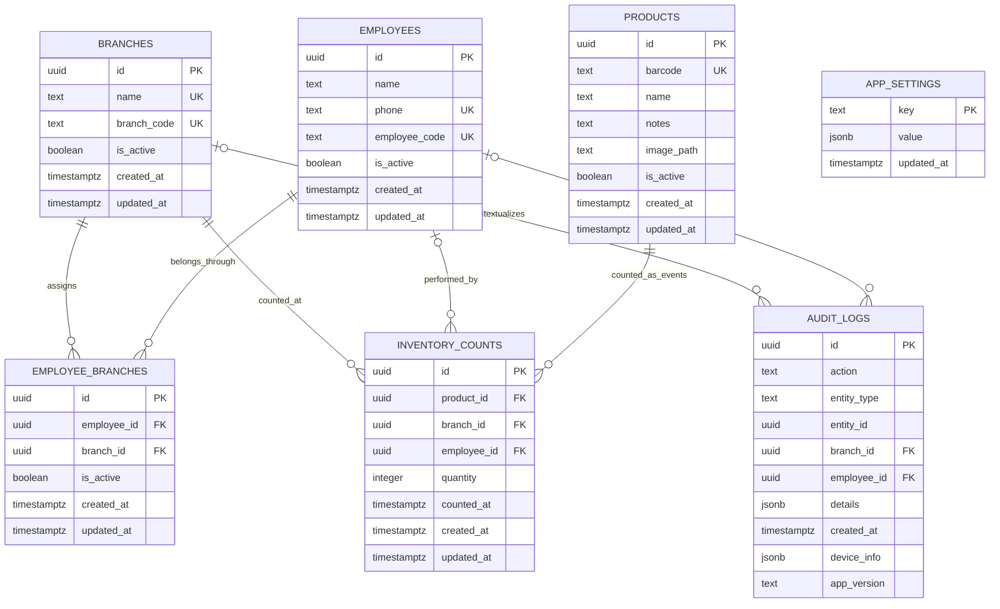

# Yelena Inventory ERD

## Relationship Diagram



## Derived View

```text
products ─────┐
              ├── inventory_counts ── latest event per product + branch
branches ─────┤                         │
employees ────┘                         ▼
                                 current_inventory
```

`current_inventory` is a read-only derivation of inventory events. It does not
store a second copy of inventory state. It joins products, branches, and the
optional counting employee, filters inactive products and branches, and picks
one deterministic latest event for every product-and-branch pair.

`app_settings` is independent system metadata. `audit_logs.entity_id` is a
generic audited-entity reference and intentionally has no foreign key because
it may identify records of different entity types.
