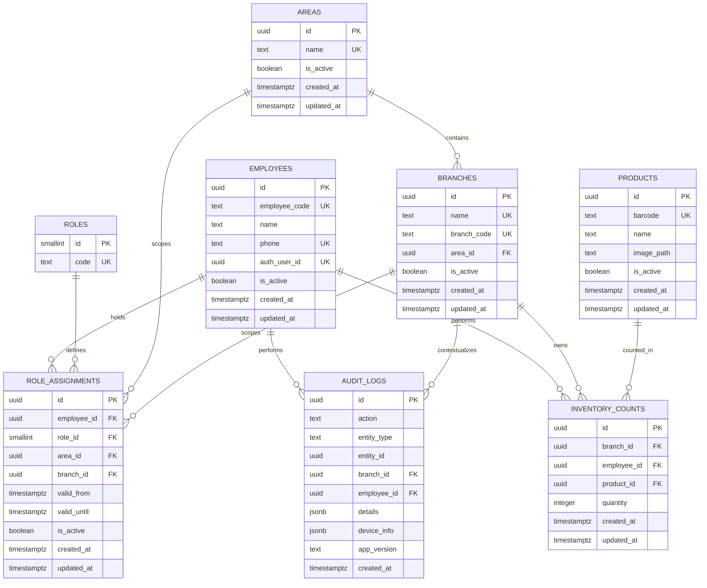

# Chapter 5 — Database Design

## Purpose

This chapter defines the database architecture of Yelena Inventory.

The database is responsible for storing business facts, preserving relationships, and protecting data integrity.

It is intentionally designed to reflect the Domain Model rather than application screens, Flutter state, or implementation shortcuts.

The database stores **facts**.

The application implements **behavior**.

---

# Design Philosophy

The database is the authoritative source of business data.

Its responsibilities are:

- Persisting business entities.
- Maintaining relationships.
- Enforcing uniqueness.
- Preventing invalid references.
- Preserving current business state.
- Supporting reliable historical investigation through Audit.

The database is not responsible for:

- UI behavior.
- Navigation.
- Permission presentation.
- Localization.
- Dynamic workflow decisions.
- Client-specific state.

Yelena Inventory follows a **Server First** architecture.

Supabase is the single source of truth.

Local storage is not authoritative and is not part of the final permission model.

---

# Database Topology

The core database topology is:



The diagram describes the target architecture.

Existing implementation details may temporarily differ during migration, but the target model remains the architectural source of truth.

---

# Core Tables

## Employees

`employees` represents one physical person per record.

Core fields:

```text
id
employee_code
name
phone
auth_user_id
is_active
created_at
updated_at
```

Rules:

- One person equals one employee record.
- `employee_code` is unique across the company.
- Employee codes are generated automatically.
- Employee codes are immutable and never reused.
- `EMP0000` is reserved for the protected Developer account.
- Regular employees begin with `EMP0001`.
- `phone` is unique.
- `auth_user_id` is nullable until first SMS verification.
- `auth_user_id` becomes unique once assigned.
- Employees are deactivated rather than deleted.
- An inactive employee cannot retain effective access.

---

## Roles

`roles` is a fixed reference table.

Core fields:

```text
id
code
```

Approved role codes:

```text
developer
system_manager
area_manager
branch_manager
deputy_branch_manager
store_employee
viewer
```

Rules:

- Roles are fixed.
- Roles cannot be created or edited from the application.
- Display names are translated in Flutter from the stable role code.
- Permissions are defined in application code.
- No permission table exists.
- No dynamic role editor exists.

---

## Areas

`areas` represents official management regions.

Core fields:

```text
id
name
is_active
created_at
updated_at
```

Rules:

- Area names are unique.
- Areas are optional.
- A small business may operate with no areas.
- Area Managers receive access through Area-scoped Role Assignments.

---

## Branches

`branches` represents physical stores.

Core fields:

```text
id
name
branch_code
area_id
is_active
created_at
updated_at
```

Rules:

- `area_id` is nullable.
- A branch may belong to one area.
- A branch without an area is not automatically accessible to an Area Manager.
- Every operational action occurs within one selected Current Branch.
- Branches are deactivated rather than hard deleted.

---

## Role Assignments

`role_assignments` is the single source of truth for authorization and branch membership.

Core fields:

```text
id
employee_id
role_id
area_id
branch_id
valid_from
valid_until
is_active
created_at
updated_at
```

Rules:

- One employee may hold multiple active assignments.
- Every assignment refers to exactly one role.
- Each role has one expected scope:
  - `developer` → global
  - `system_manager` → global
  - `area_manager` → area
  - `branch_manager` → branch
  - `deputy_branch_manager` → branch
  - `store_employee` → branch
  - `viewer` → branch
- Global assignments use neither `area_id` nor `branch_id`.
- Area assignments use `area_id`.
- Branch assignments use `branch_id`.
- `valid_from` and `valid_until` support temporary assignments.
- A Deputy Branch Manager is fully equivalent to a Branch Manager while the assignment is effective.
- Only one Deputy Branch Manager may be effective for a branch at a time.
- Effective activity depends on:
  - employee is active,
  - assignment is active,
  - current time is within the validity period when dates exist.
- Removing all valid assignments results in no effective business access.
- Branch membership is derived from active branch-scoped assignments.

---

## Audit Logs

`audit_logs` is the immutable investigation history of the system.

Core fields:

```text
id
action
entity_type
entity_id
branch_id
employee_id
details
device_info
app_version
created_at
```

Rules:

- Audit is append-only.
- Audit records are never updated or deleted.
- `employee_id` identifies the acting employee when available.
- `branch_id` identifies the business context when applicable.
- `details` stores structured event-specific information.
- Audit records business events, not UI activity.
- Developer actions may be associated with the protected `EMP0000` employee.

---

## Products and Inventory Counts

Products and inventory counts remain operational business entities.

They continue to follow the existing Server First architecture.

The permission model does not duplicate their ownership or history.

Access is evaluated from the current employee, active Role Assignments, and Current Branch.

---

# Derived Data

Some information is intentionally derived rather than stored.

## Accessible Branches

Accessible branches are calculated from active Role Assignments:

- Developer → all active branches.
- System Manager → all active branches.
- Area Manager → active branches belonging to assigned areas.
- Branch-scoped roles → explicitly assigned branches.

## Employees of a Branch

A branch employee list is derived from active branch-scoped Role Assignments.

If one employee has several roles in the same branch, the employee must be returned once.

Conceptually:

```text
Distinct Employees
from Active Role Assignments
where branch_id = Current Branch
```

## Effective Permissions

Effective permissions are the union of all active Role Assignments applicable to the Current Branch.

Permissions are not persisted separately.

---

# Removed Structure: employee_branches

The previous `employee_branches` table is not part of the target architecture.

It was removed because Role Assignments already express:

- Which employee belongs to a branch.
- Which role the employee has there.
- Whether the relationship is active.
- Whether the relationship is temporary.

Keeping both structures would create duplicate sources of truth and allow contradictions.

If a future Human Resources module requires employment-location data that is independent of application access, it should introduce a separate explicitly named business concept rather than restoring ambiguous permission duplication.

---

# Integrity Rules

The database should protect permanent business invariants where practical.

Examples:

- Unique employee codes.
- Unique phone numbers.
- Unique non-null Auth user links.
- Unique area names.
- Unique branch names and codes.
- Valid foreign keys.
- Valid assignment date ranges.
- No duplicate active assignment for the same employee, role, and scope.
- No overlapping effective Deputy Branch Manager assignments for the same branch.

Application forms also validate these rules before submission.

RLS and full server-side authorization enforcement are deferred to the dedicated security phase and remain mandatory before production use of the final authentication model.

---

# Business Logic Boundary

The database stores:

- Employees.
- Roles.
- Role Assignments.
- Areas.
- Branches.
- Products.
- Inventory Counts.
- Audit records.

The application determines:

- Which actions a role permits.
- Which controls are visible.
- Which Current Branch is selected.
- Which workflows are available.
- How role names are translated.
- How authorization is presented to the user.

---

# Design Decisions

This architecture intentionally chooses:

- A normalized schema.
- One employee record per person.
- Fixed roles.
- Role Assignments as the only permission source.
- Optional areas.
- One Current Branch operating context.
- Immutable audit history.
- Server First data ownership.
- Single-tenant deployment.

---

# Rejected Alternatives

### employee_branches

Rejected because branch membership is already represented by Role Assignments.

### Dynamic permissions tables

Rejected because permissions are fixed in application code.

### Dynamic roles

Rejected because every new role requires intentional product development.

### Role display names in the database

Rejected because localization belongs to Flutter.

### `scope_type` in `roles`

Rejected because scope is permanently implied by the fixed role code.

### `assigned_by` in Role Assignments

Rejected because assignment history belongs in Audit.

### Multiple backends sharing multiple businesses

Rejected because every business receives its own backend and database.

---

# Future Considerations

Future database work includes:

- Supabase Auth integration.
- RLS policies.
- Server-side authorization enforcement.
- Atomic employee-code generation if later required.
- Server-side audit generation for highly sensitive operations.
- Reporting and export structures.
- Backup and recovery strategy.

These additions must strengthen the existing model rather than introduce parallel sources of truth.

---

# Summary

The Yelena Inventory database represents business reality through a small, normalized set of entities and relationships.

Employees represent people.

Roles represent fixed responsibilities.

Role Assignments connect employees to those responsibilities and define their organizational scope.

Areas organize branches without becoming mandatory for small businesses.

Branches provide the single operational context in which the application works.

Audit preserves the immutable history of significant business actions.

The database remains authoritative for facts and integrity, while the application remains responsible for behavior, permissions, workflow, localization, and presentation.

This separation keeps the architecture predictable, maintainable, and capable of supporting both a single-store business and a larger multi-branch organization without changing its fundamental structure.
